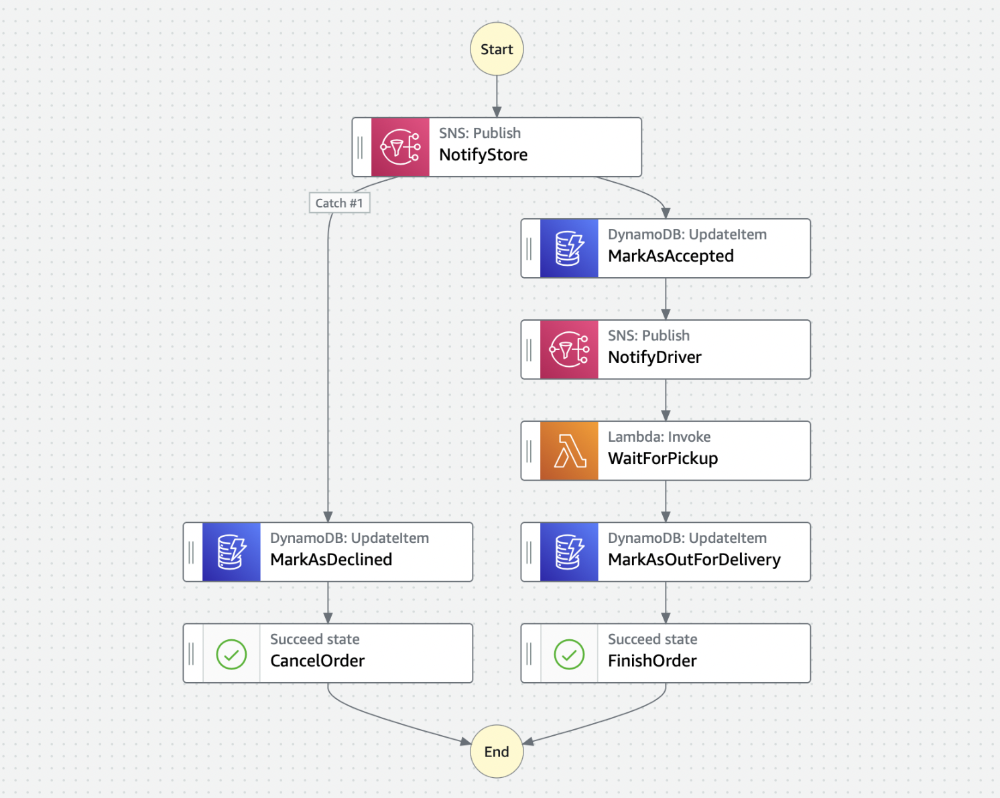

# Serverless Pizza 🍕

## Description

A pizza ordering Step Function orchestrator that coordinates the ordering and hand-offs to store and driver throughout the life cycle of an order. The application exposes a REST API for client interaction. Built using Serverless with AWS services including Step Functions, DynamoDB, SNS and SQS.

## Installation/deployment instructions

Depending on your preferred package manager, follow the instructions below to deploy the project.

> **Requirements**: NodeJS `lts/fermium (v.14.15.0)`. If you're using [nvm](https://github.com/nvm-sh/nvm), run `nvm use` to ensure you're using the same Node version in local and in your lambda's runtime.

### Using NPM 📦

- Run `npm i` to install the project dependencies
- Run `npx sls deploy` to deploy the stack to AWS

### Using Yarn 🧶

- Run `yarn` to install the project dependencies
- Run `yarn sls deploy` to deploy the stack to AWS

## Directory Structure

<details>
     <summary> Click to expand </summary>
  
```
├── AWSCLIV2.pkg
├── README.md
├── docs
│   ├── orchestrator
│   └── rest-api
├── package-lock.json
├── package.json
├── serverless.ts
├── src
│   ├── functions
│   │   ├── getOrder
│   │   ├── handleWaitForPickup
│   │   ├── orderDecision
│   │   ├── pickup
│   │   └── placeOrder
│   ├── resources
│   │   ├── dynamoDb
│   │   ├── index.ts
│   │   ├── sns
│   │   ├── sqs
│   │   └── stepFunctions
│   ├── services
│   │   ├── database
│   │   ├── directions
│   │   ├── index.ts
│   │   ├── network
│   │   └── stateMachine
│   ├── types
│   └── utils
├── tsconfig.json
├── tsconfig.paths.json
└── webpack.config.js
```

</details>

## Seeding the Store Table

- For convenience, you can seed the Store Table with some test data
- Using the AWS CLI, running the following command will get you set up with a store to place orders to

```bash
aws dynamodb put-item \
    --table-name store-table-dev \
    --item '{
        "storeId": {"S": "ouudJiBWJd0HQUafMVLvX"},
        "coordinates": {"M": {"latitude": {"N": "51.04900775883393"},"longitude": {"N": "-114.08263067482211"}}}
      }' \
    --return-consumed-capacity TOTAL
```

## Using the Directions Service

- The Directions Service uses the [openrouteservice](https://openrouteservice.org) API to retrieve directions and delivery ETAs.
- In order to use it, you need to provide your own API key and host it on the AWS SSM Parameter Store (encrypted using a KMS key).
  - The SSM Parameter Name should be stored in the `OPENROUTE_API_KEY_SSM_NAME` environment variable.
  - The KMS Key ID should be stored in the `KMS_KEY_ID` environment variable.

## Endpoints

These endpoints provide functionality to create new orders as a customer, accepting or declining an order as a store, picking up an order as a driver as well as checking the status of an order at any time during the order lifecycle.

- [Place New Order](docs/rest-api/place-order.md) : `POST /order/`
- [Accept or Decline Order](docs/rest-api/order-decision.md) : `POST /order/decision/`
- [Pickup Order](docs/rest-api/pickup.md) : `POST /order/pickup/`
- [Get Order](docs/rest-api/get-order.md) : `GET /order/<orderId>?party=<orderParty>/`

## Order Orchestrator

- Customer places an order using the `POST /order/` endpoint.
- The order is saved in DynamoDB.
- Step Function kicks off.
- Store is notified through SNS (using any subscription option like SQS, email or text message). In this example, SQS is used. A task token is used to pause the orchestrator execution until a decision is made.
- Store makes decision to either accept or decline order using the `POST /order/decision/` endpoint.
- If store declines the order, it is marked as declined in DynamoDB and the orchestrator ends early.
- If store accepts the order, it is marked as such in DynamoDB and the driver is notified of the new order through SNS.
- The `waitForPickup` lambda is invoked with a task token that is stored on the order in DynamoDB. Execution is paused until the order is picked up using the `POST order/pickup/` endpoint and the task token is sent back to the Step Function.
- The order is marked as out for delivery in DynamoDB.



## Some potential improvements:

- The option exists to buffer the SF executions as the limit for `startExecution` calls is relatively low. An potential improvemnt would be to put SQS and Lambda in front of the starting point to control concurrency in a scenario where the number of incoming request is high.
- Could connect a DynamoDB stream off the order table and connect it to a Lambda with a stream event that generates push notifications to the customer everytime there is an update to the status of their order.
